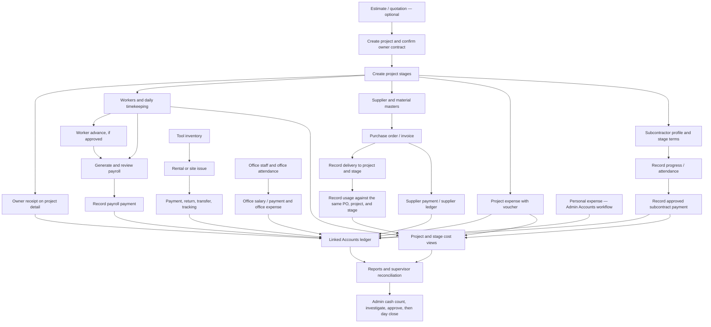

# HDC ERP — Data-Entry Operator Training & Hand-Test Plan

- **Reviewed against this repository:** 2026-09-28
- **Audience:** project/site data-entry operators, payroll and purchasing staff, supervisors, and finance administrators
- **Currency/time:** PKR; application dates and timestamps use Asia/Karachi.

> This is an operator guide and a safe, repeatable hand-test plan—not a claim that a live deployment or this guide's example scenario has been executed. Screen access and labels can differ by deployed version and user role. Follow company approvals and source documents wherever they are stricter.

## 1. Training outcomes

After supervised practice, an operator should be able to:

1. Set up a project and its stages before entering stage-linked work.
2. Enter attendance, purchases, deliveries, material use, expenses, subcontract progress/payments, and office records in the correct source module.
3. Understand which entries create a linked Accounts posting and avoid entering the same cash movement twice.
4. Review each saved entry in its source ledger, then reconcile it to project, party, stock, payroll, and report views.
5. Stop and escalate when a required record, balance, permission, or supporting document does not agree.

## 2. The operator's basic rule

**Enter the real-world event once, in the module that owns it. Then verify the source record and its linked summaries.**

Examples:

- Owner receipt → Project detail → owner receipts. Do not add the same receipt again as a generic Accounts receipt.
- Worker advance/payroll payment → worker ledger or payroll workflow. Do not add another generic Accounts payment.
- Supplier purchase/payment → Purchase V2/supplier ledger. Do not also mark the same settlement paid in a second supplier-payment flow.
- Site expense → Expenses. Personal expenses are an exception: they are posted from the Admin Accounts transaction workflow; Personal Management is mainly for categories and review.

Most operational cash events create linked unified-Accounts entries. A source record and its linked posting are **one event**, not two events. Accounts is also used for finance review and genuinely generic cash transactions; use that generic entry path only with finance authorization.

## 3. Safety, permissions, and record hygiene

### Before entering data

- Confirm you are in the **correct company, database, project, and date**. Training records belong only in an isolated staging/training database.
- Match every entry to the source document: approved contract, signed attendance, supplier invoice/challan, delivery note, usage slip, expense voucher, subcontractor approval, or payment proof.
- Search the relevant list/ledger before re-entering an item. A slow page or unclear confirmation is **not** a reason to click Save repeatedly.
- Use the correct project **and stage** wherever the form asks. A stage must belong to the selected project.
- Keep units, quantities, rates, and dates exactly as supported by the source document. Do not guess missing values.
- Add a useful reference in Notes/Remarks (voucher, challan, payroll period, or approval number) when the form provides one.

### Role access (important for training setup)

- Operational money-writing routes are guarded for **Admin or Accountant** roles. A page may be readable to other roles while its Save action is denied.
- In the source reviewed for this guide, Accounts, Money Center, and several Accounts review/administration pages have **admin-only route checks**. The README describes some of these screens more broadly, so an Accountant's access to the live deployed version should be checked with the administrator. For Accounts review and day close, train with an Admin unless the deployment confirms otherwise.
- Do not use an ordinary Operator/Staff login to test financial writes in production. Permission-denial tests belong in staging.

### Corrections and dangerous controls

- Preserve traceability. Where the screen offers **Void** with a reason, use the approved void-and-re-enter procedure rather than silently editing history or creating a second entry. Confirm the void also reverses its linked Accounts posting.
- Some records have Delete controls or administrator-only repair tools. Do not use them to correct live financial history without the supervisor/administrator.
- Settings includes backup/restore, maintenance/backfill, and permanent-wipe operations. **Never use restore, backfill, or wipe as an operator test, and never experiment with them against live data.**
- Do not lock a production cash day while testing. A cash-day lock carries the counted balances forward and rejects back-dated entries. A variance above PKR 5,000 requires a written reason and explicit confirmation; investigate it before approval.

## 4. Application workflow chart

The main dependency is **Project → Stages → operational records → ledgers/reports → finance close**. Estimation is optional; office, personal, and tool-rental records have their own branches.

A useful one-line entry order for a new job is:

**Estimate (if used) → Project → Stages → Owner receipt → Workers → Attendance → Advances → Payroll/payment → Supplier/materials → PO → Delivery → Usage → Expenses → Subcontractor/stage terms → Progress/payment → Office/tool/personal entries as applicable → Source-ledger checks → Project/reports → Admin cash reconciliation.**

Not every item happens every day. The sections below explain the normal sequences and the hand-test dataset.

## 5. Module map: what to enter and where to verify

| Workflow | Enter in | Verify afterward |
|---|---|---|
| Project and contract | Projects; create each Stage from project detail | Project detail: contract value, stages, dates, progress, receipts and costs |
| Owner/client receipt | Project detail → receipt form; select the actual receiving company cash/bank account | Project receipt list/receipt; Accounts ledger and cash report (Admin review) |
| Site workers and trades | Workers/Trades | Worker profile, active status, wage type/rate, worker ledger |
| Daily work/attendance | Timekeeping / Attendance day sheet | Attendance by date, worker ledger work entries, project/stage cost |
| Worker advances | Worker → Advance | Worker ledger; payroll's date-range advance deduction; linked Accounts entry |
| Payroll | Payroll → Generate for a non-overlapping From/To range; review, then pay | Payroll run/item, worker ledger/payment record, Accounts posting |
| Supplier/material/PO | Purchase V2 → Suppliers, Materials, Purchases | Supplier detail/ledger; purchase order; PO amount and payment status |
| Deliveries | Purchase V2 → Delivered | Delivery log, remaining PO quantity, material/stock view |
| Material usage | Purchase V2 → Usage; select material, project, stage, and PO | Usage log, PO-scope available stock, usage cost, stage/project costs |
| Project expense | Expenses; choose project, stage if applicable, category and voucher detail | Expense list/detail, stage/project expense total, linked Accounts entry |
| Subcontractor | Project detail → create/assign to stage and set terms; record progress and payments in the subcontract workflow | Subcontractor ledger, remaining payable/retention, stage/project costs |
| Office staff | Office Management → staff, attendance, salary/payment | Staff attendance, staff ledger, Office Expenses (overhead—not a site expense) |
| Personal expense | Admin → Accounts transaction workflow | Personal Management filters/categories and Accounts ledger; not the Personal Management page's entry form |
| Tools | HDC Tools → Inventory → rental/detail | Inventory available/rented quantities, rental balance, returns/transfers/tracking, Accounts receipt |
| Estimates | Estimation calculator or Project Estimation | Saved estimate/quotation; if converted, confirm there is one project, not a duplicate |
| Reports and close | Reports; Accounts/Cash Flow/Day Close with authorized Admin | Compare report totals to source ledgers; count physical cash before an approved lock |
| Reference lists | Trades, Expense Categories, and any stage/reference setup | Select the approved existing value in transaction forms; ask a supervisor before adding near-duplicate categories/trades |
| Project documents | Project detail → stage drawings/documents, where used | Confirm the file is attached to the correct project/stage and opens; keep the approved original in the records system |
| Dashboard and Alerts | Dashboard / Alerts | Treat these as prompts and summaries; open the owning source record to investigate or correct an issue |
| Audit and user setup | Admin user administration, Event Recorder, and row traceability | Admin checks role access and who/when created, changed, or voided a record; audit screens are not a substitute for correcting at source |
| Settings and backups | Admin-only Settings | Admin follows the approved backup/maintenance procedure. Restore, backfill, and permanent wipe are excluded from operator practice |

### Estimation and materials notes

- The **Estimation** calculator is a planning/calculation aid; it is not a substitute for the approved contract or a project cost posting. **Project Estimation** can hold a staged estimate and support project creation/conversion. Confirm the converted project and stages before entering operations, and do not create a second project for the same estimate.
- Use **Purchase V2** for current supplier → PO → delivery → stage-scoped usage. Do not enter the same new materials in a legacy materials screen as well. Use legacy material records only when a supervisor explicitly directs historical work there.

## 6. Normal operating procedure

### A. Start a project

1. Check the approved client/owner, location, project code, contract type, scope, dates, and supporting estimate/contract.
2. Create one Project. Use the generated/approved unique code and a name that operators can search. Set client, phone, location, start/planned-end dates, and status accurately.
3. Add Stages before stage-linked work. For each stage, enter its name/order, status, contract basis (Per Sq Ft or Lump Sum), applicable rate/discount/quantity or lump sum, estimated cost if approved, progress, and dates.
4. Verify the stage contract totals and project-level owner contract on Project detail. Do not assume a project has a contract value just because the project record exists; stage values (or the project's contract terms where no stage contract exists) drive it. For an approved contract/rate change, use the stage edit/history workflow and record the reason; do not create a duplicate stage to represent a revision.
5. Record owner receipts from Project detail, entering the amount, actual date, remarks/reference, and actual receiving company account. Verify the receipt and remaining receivable.

### B. Daily site workforce and payroll cycle

1. Set up each worker once with correct trade, active status, wage type, and approved rate. The time sheet lists active workers; a second test/real attendance record is not a substitute for a worker profile.
2. Open the correct Timekeeping date sheet. Mark each worker accurately: Present, Absent, Leave, or Not Assigned. For work, add the correct project/stage allocation and hours. For a daily-wage worker, the first 8 regular hours calculate up to one daily rate (prorated below 8); hours above 8 are tracked as OT and paid in addition. Hourly-worker OT is paid at the current straight hourly rate. Per-square-foot workers must have the actual quantity entered or calculated wage can be zero. Do not assume site Leave is paid from the status label; follow approved policy and inspect the payroll preview.
3. Save once. Verify the date, status, project/stage, hours, OT, and worker-ledger work amount. Correct a bad allocation before payroll is generated.
4. Record an approved advance in the worker's Advance form, with date, amount, optional project/stage, and reason/reference. Verify the advance in the worker ledger.
5. At the payroll cutoff, enter a From/To range that does not overlap another payroll run. Review each worker's hours, day statuses, gross, advances, net, prior payments, and balance. A payroll run does not pay anyone automatically.
6. After authorization, use the run's payment action once (per worker, or Pay All if authorized). Verify the run's paid/balance figures and worker ledger. The payable is capped by the worker's actual ledger balance, including advances, payments, and settlements outside the run.
7. Do not generate overlapping runs for the same dates: the application refuses an overlapping range to prevent paying the same work twice. Do not use a second payment path for the same payroll amount.

### C. Supplier purchase, delivery, usage, and payment

1. Create/find the supplier and material first. Keep units consistent (for example bag, kg, or pcs) and avoid duplicate supplier/material names.
2. Create a Purchase V2 PO with supplier, date, payment status, invoice/challan reference, material line(s), quantity, unit rate, and notes. A multi-line purchase makes a separate PO and supplier-ledger entry for each material line.
3. For a separate/partial supplier settlement, leave the PO **Unpaid**, then record the actual amount once on the supplier's payment form. For an immediately fully paid PO, use the intended paid path. **Do not both mark a PO paid and record the same full settlement again**; clarify with the finance supervisor if the source documents do not show which path applies.
4. Record each physical delivery against the correct PO, quantity, project, and—where known—stage, date, driver/delivery person, and delivery note. The displayed PO remainder is the maximum you can deliver.
5. Record material usage against the same material, PO, project, and required stage, with actual quantity/date/reference. Usage is stage-scoped and cannot exceed available stock for that PO in that project/stage.
6. Verify purchase, delivery, usage, remaining stock, supplier balance, and stage cost. Purchase/payment and material consumption are different events: do not enter delivery as usage or usage as another purchase.
7. On the **Purchases**, **Delivery**, and **Usage** entry forms, read the dialogue box that opens after each save before carrying on: it states *Entry Saved*, *Entry Not Saved*, or *Saved With a Warning*. An entry that is incomplete or over the delivered/available quantity is refused by the same box *before* it is sent, so nothing is half-saved and a retry keeps what was typed. Never treat a filled-in form as a saved record; if the box was dismissed unread, the banner at the top of the page repeats the same message.

### D. Project expenses

1. Enter each approved site expense once in Expenses; choose its project and stage when applicable, date, category, amount, and a meaningful voucher/receipt description.
2. Confirm that the row appears in the expense list and rolls up to the intended project/stage. Ensure the matching Accounts posting exists; do not manually post a second generic outflow.
3. Office overhead is not a project site expense. Use Office Management for office costs/staff entries.

### E. Subcontractors

1. Create/find the subcontractor, then assign the correct project stage and record approved pricing terms: lump sum or per-square-foot quantity/rate, retention percentage, and supporting agreement.
2. Record stage/work progress and any required attendance using the subcontract workflow. Keep the progress percentage supported by supervisor approval.
3. Before paying, review contract value, progress-based payable, retention, previous payments/settlements, and remaining balance. Enter the approved payment once with the correct date, stage, amount, and reference.
4. Verify the subcontractor ledger and stage/project subcontract cost. A payment above the remaining contract balance is blocked; do not work around the validation.

### F. Office staff, personal expenses, and tools

- **Office staff:** create the staff record, enter office attendance (separate from site-worker Timekeeping), review the salary calculation, then record an authorized advance/payment. In the current app calculation, Present and Weekly Leave each count as one attendance unit; Absent counts as zero. Apply the approved leave policy, and verify the staff ledger and automatically linked Office Expenses. Office salaries remain overhead, not project labour.
- **Personal expenses:** use only the Admin Accounts transaction workflow for the cash entry. Use Personal Management to maintain categories and review/filter the result. Do not invent an entry form on the Personal Management page or repeat an Accounts entry there.
- **Tools:** set up inventory quantity, condition, unit, and rental rate. Create an internal project/site movement or external rental; check available stock before dispatch. Use rental detail for payments, returns, and transfers. Verify pending quantity, rental balance, receipt/account, and movement/tracking history.

### G. Review and daily close

1. Use project detail and reports to compare contract, received amount, direct costs, stage progress, and remaining receivable.
2. Compare each party subledger (worker, supplier, subcontractor, office staff) to the underlying source events and approvals.
3. For purchase/stock, reconcile invoice quantity → delivered quantity → used quantity → balance.
4. An authorized Admin reviews Accounts/All Entries and the Reconciliation Check for missing, duplicate, or mismatched linked postings. Review Cash Flow by account and day.
5. Count actual cash/bank balances against the ledger. Investigate every difference. Only an authorized approver may save counted balances and lock the day after approval. A lock carries closing balances forward; do not backdate after locking.

### Recommended review cadence

| Cadence | Operator/supervisor review |
|---|---|
| Each workday | Signed site attendance; project/stage allocations; material deliveries and usage; expense vouchers; subcontract progress; tool dispatch/returns; saved rows and references |
| Each payroll period | Attendance completeness; non-overlapping date range; advance deductions; gross/net; payment approval and worker balances |
| Weekly | Open supplier balances/PO quantities; material stock; subcontract progress/payments; outstanding tool rentals and returns; project progress/receipts |
| Month end | Office attendance and salary; project and party ledger summaries; cash/bank reconciliation; reports; approved backup and cash close by an Admin |

These are recommended supervisory checkpoints, not automatic system schedules. The source record and the company's approval policy remain authoritative.

## 7. Supervised hand-test: one complete sample job

### Test boundary and initial conditions

**Run only against a throwaway/staging database.** This example deliberately creates financial records and linked cash movements. Never run it on live data. Start from a clean database with no pre-existing transactions, no opening supplier balance/stock for the demo records, and an active `Company Cash` account with a zero opening balance. If those conditions are not true, the exact cash total below will not apply.

Let **D** be the application's current date in the staging database and confirm that it has not been day-locked. Use today's date for this sample because some payment forms post using the current date. The office salary calculation divides monthly salary by the number of calendar days in that month. Use names prefixed `TRAINING` so they are easy to find. Use fake contact details only.

### Enter these records in order

| # | Enter this record | Sample values / actions | Immediate check |
|---:|---|---|---|
| 1 | Project | `TRAINING — Demo House`; unique code; client `Training Owner`; location `Sandbox`; start date D; active | Project detail opens; project code/name are searchable |
| 2 | Two stages | `Foundation`: Lump Sum PKR 60,000. `Masonry`: Lump Sum PKR 40,000. Add dates/status; estimated-cost fields may be left blank or set only as clearly labelled estimates. | Two stages belong to this project; total stage/owner contract is PKR 100,000 |
| 3 | Owner receipt | On project detail, amount PKR 20,000, date D, reference `TRAIN-RECEIPT-01`, receiving account `Company Cash` | One project receipt; remaining receivable PKR 80,000; a linked Accounts receipt exists |
| 4 | Workers | Create `TRAINING Mason`, daily wage PKR 1,000, active; create `TRAINING Helper`, daily wage PKR 800, active. Use existing trades or have the supervisor set them up. | Both profiles have the intended daily wage type/rate and appear on Timekeeping sheet |
| 5 | Timekeeping | Date D. Mark Mason Present; allocate 10 hours to this project's Foundation stage. Mark Helper Absent. Save. | Mason: 10 total hours, 8 regular + 2 OT, calculated wage PKR 1,250 (1,000 + 2 × 125). Helper: no work wage. Worker ledger shows Mason work PKR 1,250 |
| 6 | Worker advance | Mason: PKR 250 on D, project = Demo House, stage = Foundation, note `TRAINING ADVANCE-01` | Mason ledger shows advance PKR 250; linked cash outflow PKR 250 |
| 7 | Payroll run/payment | Generate a run From D to D. Review both workers, then pay Mason's net balance once. Do not use both an individual payment and Pay All. | Mason gross PKR 1,250 − advance PKR 250 = net PKR 1,000; one PKR 1,000 payroll payment; Helper has zero; worker payable becomes zero |
| 8 | Supplier/material | Create supplier `TRAINING Cement Supplier` with opening balance 0. Create material `TRAINING Cement` with unit `BAG` (choose the matching displayed unit). | Supplier/material visible in Purchase V2 lists; no opening stock or payable was introduced |
| 9 | Purchase order | One PO: 20 bags at PKR 1,000 each = PKR 20,000; date D; challan `TRAINING-CH-01`; Payment = **Unpaid**. | PO quantity 20, line total 20,000; supplier ledger payable 20,000; no cash paid yet |
| 10 | Delivery | Deliver 20 bags from that PO to Demo House → Foundation on D; use a training delivery-person/note. | PO remainder 0; delivered quantity 20; Foundation-scoped available stock 20 |
| 11 | Material usage | Select the same cement, project, Foundation stage, and PO. Record 5 bags on D; note `TRAINING USE-01`. | Usage cost PKR 5,000 at PO unit cost PKR 1,000; stage stock is delivered 20, used 5, available 15 |
| 12 | Supplier payment | On supplier detail, record one payment of PKR 5,000 with note `TRAINING SUPPLIER PAYMENT-01`. Do not change the PO to Paid as well. | Supplier payable becomes PKR 15,000; one linked Company Cash outflow PKR 5,000 |
| 13 | Project expense | Enter a PKR 300 expense on D for Demo House → Foundation. Use an existing approved category (or a training-only category) and reference `TRAINING VOUCHER-01`. | One expense row; Foundation/project expense cost PKR 300; linked cash outflow PKR 300 |
| 14 | Subcontractor and stage terms | Create `TRAINING Masonry Sub` from the project workflow; assign to Masonry; Lump Sum contract PKR 20,000; retention 10%. Record approved progress 50%. | Subcontractor is linked to the correct project/stage; at 50%, progress-based payable is PKR 10,000 (retention cap is PKR 18,000) |
| 15 | Subcontract payment | Record one approved payment PKR 4,000 on D, linked to the Masonry stage, with reference `TRAINING SUB-PAY-01`. | Subcontractor payment/cost PKR 4,000; remaining progress-based payable PKR 6,000; linked cash outflow PKR 4,000 |
| 16 | Office staff branch | Create `TRAINING Office Clerk`, monthly salary PKR 30,000; enter one Present office-attendance day D; review the displayed earned balance and pay exactly that authorized amount once. | One attendance unit. One day earned = PKR 30,000 ÷ days in that month (PKR 1,000 in a 30-day month such as Sep 2026). Payment and linked Office Expense equal the displayed earned amount; staff balance is zero |
| 17 | Final review | Open each source ledger and the project, stage, stock, reports, and authorized Accounts review screens listed below. | All amounts reconcile to the expected results in the next section; no duplicate source or cash entries |

**Optional separate tool branch (staging only):** add a `TRAINING Drill` tool with quantity 2 and rental rate PKR 500/day; create an external one-unit rental, collect PKR 500 to Company Cash through rental detail, then record the actual return. Verify rental payment PKR 500, pending quantity 0, and store availability back to 2. If included, add PKR 500 to the sample's Company Cash result below. Do not include it in the core project costs.

**Optional personal-expense branch:** only with an Admin and only if the trainer wants to test this workflow. Record one training-only personal disbursement from Accounts and verify it in Personal Management and Accounts. Subtract that amount from the sample Company Cash result; it is not a project cost.

### Expected results for the core sample

These totals assume a fresh training DB, no other activity, a zero Company Cash opening balance, and a 30-day test month for the office salary payment.

| Screen / report | Expected result |
|---|---|
| Project contract / receipt | Contract PKR 100,000; owner receipt PKR 20,000; receivable PKR 80,000 |
| Project direct costs | Labour 1,250 + Purchase V2 usage 5,000 + project expense 300 + subcontract payments 4,000 = **PKR 10,550** |
| Project net profit indicator | PKR 100,000 contract − PKR 10,550 direct costs = **PKR 89,450**. Office salary is overhead and should not be added to site project costs. |
| Foundation stage | Labour 1,250 + material usage 5,000 + expense 300 = **PKR 6,550** |
| Masonry stage | Subcontract payment = **PKR 4,000** |
| Worker ledger / payroll | Mason earned 1,250; advance 250; payroll payment 1,000; remaining worker payable **0**. Helper absent, no work pay. |
| Purchase V2 / supplier | Purchased 20 bags = PKR 20,000; delivered 20; used 5; available 15. Supplier purchase/payable 20,000 − payment 5,000 = **PKR 15,000 due**. |
| Subcontractor | Contract PKR 20,000; retention 10% = PKR 2,000; 50% progress payable PKR 10,000; paid PKR 4,000; remaining progress balance **PKR 6,000**. |
| Office staff | One present day; earned and paid = PKR 30,000 ÷ days in month (PKR 1,000 in a 30-day month); ledger balance 0; one linked Office Expense. |
| Company Cash (Admin review) | Owner +20,000 − worker advance 250 − worker payroll payment 1,000 − supplier payment 5,000 − project expense 300 − subcontract payment 4,000 − office payment 1,000 = **PKR 8,450 closing balance**. If the month is not 30 days, replace the office 1,000 with `30,000 ÷ days in month`; if opening cash or other activity exists, compare the change from the true starting balance instead. |

The Company Cash formula does **not** count the unpaid PO as cash paid, does not count attendance/earned wages as cash until paid, and does not count material usage as another cash payment. The linked source transaction is the cash movement. Optional tool/personal transactions adjust cash as described above.

## 8. Where to verify the saved results

Use filters for the training name/reference and D. Verify in this order so an error can be isolated to its source:

1. **Project detail:** correct project and two stages; contract PKR 100,000; owner receipt and remaining receivable; project costs and progress.
2. **Attendance / worker ledger:** Mason's Present row, 10 hours/2 OT, Foundation allocation and work PKR 1,250; Helper Absent; Mason advance and payment; net balance zero. Compare Payroll run items to the worker ledger.
3. **Purchase V2 Purchases / supplier detail:** unpaid PO for 20 bags × 1,000; supplier debit/payable 20,000; one payment 5,000; supplier balance 15,000.
4. **Purchase V2 Delivered / Usage / Stock:** delivery to the intended project/stage, usage against the same PO, 20 delivered / 5 used / 15 available, cost PKR 5,000.
5. **Expenses:** one PKR 300 voucher tied to Foundation; verify project/stage roll-up and linked Accounts posting.
6. **Subcontractor ledger and project detail:** assigned to Masonry, contract/retention/progress, one PKR 4,000 payment and PKR 6,000 remaining progress balance.
7. **Office Management:** one Present attendance unit, salary calculation, payment and linked office-expense row. Keep this out of project site costs.
8. **Reports:** project, stage-cost, worker, material, time, expense, and Glance views should agree with the amounts above. A report is a cross-check, not a replacement for the source ledger.
9. **Admin Accounts:** review the linked transaction(s), account and source/reference for every cash event; use Cash Flow and Reconciliation Check to investigate any mismatch. Do not post a second generic transaction to make a report total look right.
10. **Cash/day close:** in staging, compare ledger closing cash to the sample formula. A test may exercise counted balance/lock only if the trainer deliberately resets a disposable database afterward. Never use a production day lock as a test.

## 9. Negative and boundary tests (staging only)

Use a disposable project/PO or resettable test database for tests expected to be rejected; do not contaminate a real job with failed test records.

- **Missing required data:** leave a required project/stage/material/PO/quantity blank. The form should reject the save or browser validation should prevent submission; then verify no partial source record was added.
- **Wrong stage/project pair:** choose a stage from another project in a test form/API if the screen allows it. The server should reject the mismatch; do not retry by submitting repeated variations in production.
- **Excess delivery:** on a disposable PO, try to deliver more than the remaining PO quantity. The application should reject it and leave the prior delivered total unchanged.
- **Excess usage:** with 15 bags available in the sample stage, try a disposable usage of 16. The application should reject it and leave available stock at 15.
- **Overlapping payroll range:** generate a second test run whose date range overlaps the existing run. The app should direct the user back to the existing run rather than create an overlapping run. Confirm the worker has not been paid a second time.
- **Payroll payment cap:** after paying the sample Mason's PKR 1,000 run balance, verify the run reports no pending balance; do not create a manual second payment.
- **Permission check:** in staging, sign in with an ordinary Staff/Manager role and verify a protected money write is denied. Then confirm the intended Admin/Accountant role can perform the authorized workflow. Check actual live deployment role access before training; do not assume Accounts screens are available to Accountant.
- **Duplicate-submit check:** on a disposable test entry, submit once and wait for confirmation. Search the source list before any retry. Duplicate guards are helpful but are not a substitute for checking whether the first submission succeeded.

For every failed check, stop. Record the screen, project/record reference, date, expected and actual values, and user role; give this to the supervisor/admin. Do not compensate with a balancing entry or repeat the submission until the existing record has been found and reviewed.

## 10. Suggested training sessions and sign-off

### Session 1 — navigation and master data

- Demonstrate login, role-specific navigation, date handling, search/filtering, Projects, Stages, worker, supplier, and material records.
- Trainee explains why stage-linked operations must wait until the project stages exist.
- Trainee creates the isolated sample project/stages and finds them again from list/search screens.

### Session 2 — daily operational entries

- Practice attendance (including Absent/Not Assigned, hours/OT, and per-square-foot quantity), one purchase, one delivery, one usage, and one expense.
- Trainee verifies each saved row in the owning ledger and links it to its project/stage.
- Practice subcontractor stage assignment/progress and a tool return only in staging.

### Session 3 — payroll, accounts awareness, and reconciliation

- Trainee previews payroll, explains gross/advance/net, and identifies the one authorized payment path.
- Supervisor demonstrates supplier balance, project cost, office overhead, linked Accounts entries, reports, and the Admin-only cash close.
- Trainee identifies the no-double-entry rule, the role restriction, and the correct escalation path for a mismatch.

### Operator sign-off checklist

- [ ] Can create/find the correct project and stage without making a duplicate.
- [ ] Can enter one attendance sheet and verify its worker ledger wage/OT.
- [ ] Can explain why a per-sq-ft worker needs a quantity and why an absent worker has no work wage.
- [ ] Can create a PO, record a delivery, and record usage against the correct PO/project/stage.
- [ ] Can show that supplier payment, worker payment, owner receipt, expense, and subcontract payment each have one source entry and a linked account posting—not a duplicate generic transaction.
- [ ] Can review a payroll run before payment and recognizes overlapping periods/zero balances.
- [ ] Can find the project, party, stock, office, and report checks relevant to an entry.
- [ ] Knows that day close, restore, backfill, wipe, and financial-history deletion are not operator test actions.
- [ ] Knows when to stop and escalate rather than guess, duplicate, or force a balancing entry.

## 11. Source notes

This plan follows the current navigation, forms, route guards, ledger-posting helpers, business calculations, and report/test references in the repository (including `README.md`, `templates/hdc/shared/base.html`, `hdc/routes/`, `hdc/services/`, `hdc/models/`, and feature/acceptance tests). The sample figures are hand-calculated examples from the app's current rules; they are not a test run, accounting approval, or substitute for company policy. Re-check the live deployment if its version, access roles, forms, categories, or approval policy differs.
